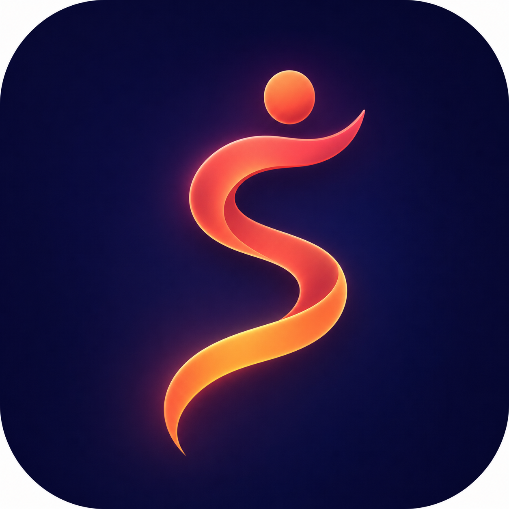
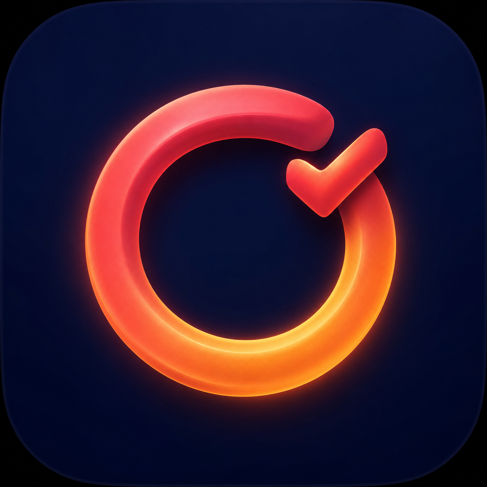
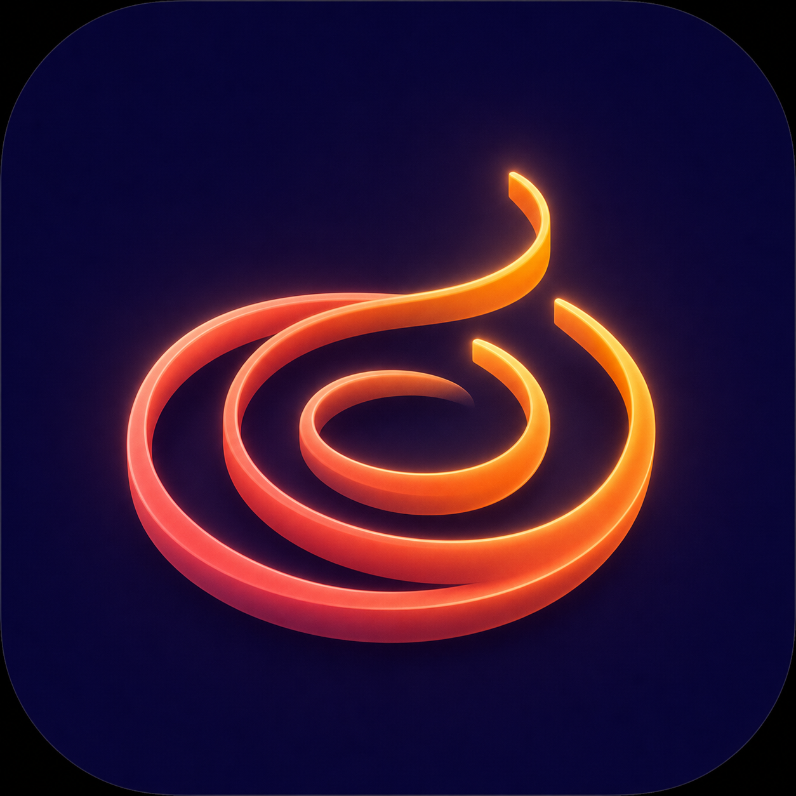

# Strivory

**记录一生的每一次动起来 · Build a lifetime of movement.**

Strivory 是一款原生 iPhone 运动年历应用。它读取 Apple 健康中的 Workout 记录，或导入 CSV 历史数据，将每天的主运动整理为按周排列的年度热力图，并生成可分享的多年运动海报。

Strivory is a native iPhone movement-calendar app. It turns Apple Health Workouts and CSV history into yearly heatmaps and shareable multi-year posters.



## Features

- **Apple Health Workouts** — read-only access to Workout records; Strivory never writes data back to Apple Health.
- **Daily primary activity** — workouts shorter than 10 minutes are excluded; when multiple workouts exist on a day, the category with the longest total duration is shown.
- **Yearly heatmaps** — Monday-to-Sunday rows and week columns, inspired by contribution graphs.
- **Workout categorisation** — strength, running, cycling, swimming, ball sports, board sports, outdoors, mind & body, dance, combat, rowing, and other.
- **CSV imports** — import historical activity data, then choose whether an import supplements or overrides Apple Health for matching days.
- **Posters** — export multi-year PNG posters in Editorial and Night Atlas templates; share them or save them to Photos.
- **iCloud Backup & Restore** — optional private CloudKit backup of app-owned Workout snapshots, CSV batches, and the export display name. Automatic backup runs at most once per day; manual sync is available in Settings.
- **Languages** — Simplified Chinese and English, selectable inside the app.

## Screens

| Today | History | Poster insights |
| --- | --- | --- |
|  |  |  |

## CSV import format

CSV files must include a date column and a workout-type column. English and Simplified Chinese headers are supported.

```csv
date,workout_type
2025-01-01,Outdoor Run
2025-01-02,Strength Training
2025-01-04,Pool Swim
```

Supported headers:

| Date | Workout type |
| --- | --- |
| `date` or `日期` | `workout_type` or `运动类型` |

Dates use `yyyy-MM-dd`. Future dates and duplicate dates within the same import file are rejected. A review/demo sample is available at [docs/strivory-review-sample.csv](docs/strivory-review-sample.csv).

## Build and run

### Requirements

- macOS with Xcode
- iOS 17.0 or later deployment target
- An Apple Developer team for HealthKit and iCloud capabilities

### Setup

1. Clone the repository and open `Strivory.xcodeproj` in Xcode.
2. Select the `Strivory` target and set your signing team and bundle identifier.
3. Under **Signing & Capabilities**, enable:
   - **HealthKit**
   - **iCloud** → **CloudKit**, with an iCloud container assigned to your App ID
4. Run on a physical iPhone, grant read access to Apple Health Workouts, and tap the Health sync button.

For CloudKit schema deployment and restore testing, see [docs/iCloud-backup.md](docs/iCloud-backup.md).

## Privacy

Strivory has no account system, advertising SDK, third-party analytics, tracking SDK, payment flow, or developer-owned data server.

- Workout and CSV data are processed locally by default.
- iCloud Backup is disabled by default and, when enabled, uses the current Apple ID's **private** CloudKit database.
- Saving an exported poster requests Photos **add-only** permission.

Read the full [Privacy Policy](https://pananq.github.io/strivory/privacy.html) and [Support page](https://pananq.github.io/strivory/support.html).

## Project structure

```text
Strivory/
├── AppStore.swift             # App state, health archive, CSV batches, iCloud coordination
├── HealthKitService.swift     # Workout authorization and incremental HealthKit sync
├── CloudBackupService.swift   # Private CloudKit backup and conflict merge
├── CSVImporter.swift          # CSV parsing and validation
├── ContentView.swift          # Home calendar and activity details
├── ImportExportViews.swift    # Import flow, settings, posters, sharing, Photos save
├── Models.swift               # Data models, categories, calendar helpers
└── *.lproj/                   # English and Simplified Chinese strings
docs/
├── privacy.html
├── support.html
└── iCloud-backup.md
```

## Support

For questions or feedback, email [strivoryapp@gmail.com](mailto:strivoryapp@gmail.com).

© 2026 Strivory. All rights reserved.
